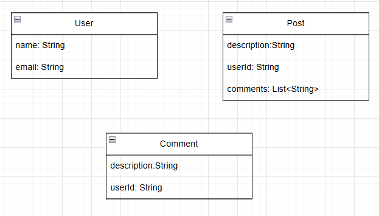

# System Specification 
You will build a social platform where user can make posts. other users can make comments on the posts.User can make CRUD operations on user's own post and comment.User only can comments there will be no reply to a comment.
# Schema Design

# Social Platform Queries
Please for every scenario try by yourself first and then see the solution
* [Queries](query/social-platform/socail-platform-query.md)